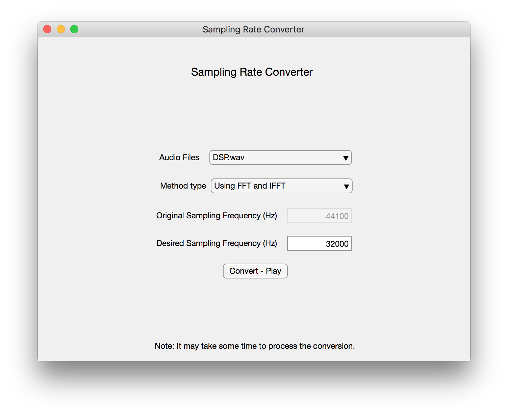

# Sampling Rate Converter

## What is it?
Sample-rate conversion is the process of changing the sampling rate of a discrete signal to obtain a new discrete representation of the underlying continuous signal.

## Applications
Example: Sample an audio file from 44.1 kHz to 32kHz in order to transmit it through a low-bandwidth communication link.

## Instructions
- Ensure you have **app designer** installed for MATLAB
- Open MATLAB and double click on **rateConverter.mlapp**

## GUI

## Citation
- [Rational Sampling Rate Converter using Coefficient Symmetry](https://pdfs.semanticscholar.org/c98d/c12c3292a2780e5dfe5be8bb22d4298889dd.pdf)
- Proakis, J. G., & Manolakis, D. G. (2007). Digital signal processing (4th ed.). Upper Saddle River, N.J. : New Delhi: Pearson Prentice Hall.

